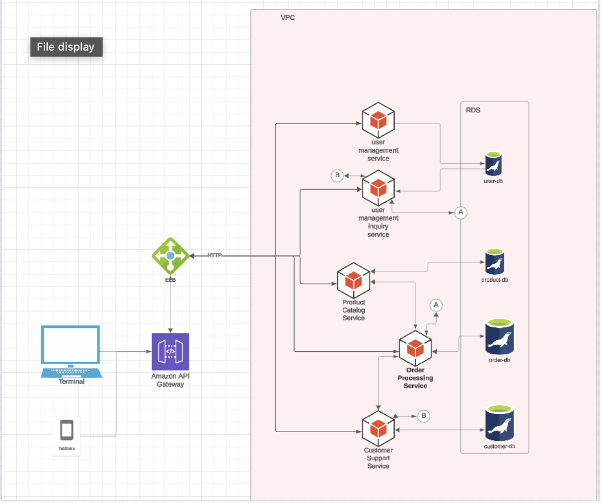

## Componentes Principales:
### Amazon EC2 (Elastic Compute Cloud):

Proveer instancias de servidor escalables para manejar la lógica de la aplicación y peticiones de los usuarios.
* __Configuración__:
Implementa varias instancias EC2 detrás de un Elastic Load Balancer (ELB) para distribuir el tráfico de manera uniforme.
Usa Auto Scaling Groups para ajustar automáticamente el número de instancias EC2 en función de la carga de tráfico entrante.

### Amazon S3 (Simple Storage Service):

Almacenamiento de objetos para contenido estático (imágenes, videos, backups, etc.) y como almacenamiento de datos escalable.
* __Configuración__:
Crea un bucket S3 para almacenar los activos estáticos de tu aplicación.
Configura permisos de acceso adecuados para proteger tus datos.

### Amazon VPC (Virtual Private Cloud):

Ofrecer un entorno de red aislado en la nube, donde puedes lanzar tus recursos de AWS.
* __Configuración__:
Crea una VPC para aislar tus recursos de red y mejorar la seguridad.
Dentro de la VPC, configura subredes públicas para los balanceadores de carga y subredes privadas para las instancias EC2.
Usa tablas de rutas para controlar el tráfico entre las subredes y con el exterior, empleando gateways de Internet y NAT si es necesario.

### Amazon RDS (Relational Database Service):
Almacenamiento de informacion mediante una baes de datos gestionada por aws
* __Configuración__:
Habilita la implementación Multi-AZ para mejorar la disponibilidad y la tolerancia a fallos proporcionando un sitio de recuperación en una zona de disponibilidad diferente.
  Considera habilitar Autoscaling para el almacenamiento de RDS si anticipas que tu uso de datos crecerá con el tiempo.

## Diseño Básico de Arquitectura:
* Front-end (Balanceo de carga y entrega de contenido):

* Implementa un Elastic Load Balancer para manejar peticiones entrantes y enviarlas a las instancias EC2.
Capa de Aplicación (Cómputo):

* Despliega instancias EC2 dentro de Auto Scaling Groups dentro de subredes privadas para manejar la lógica de negocio.
Puedes colocar varias Availability Zones para mejorar la tolerancia a fallos.

* Usa Amazon S3 para guardar y recuperar archivos estáticos o pesados.
Networking:

* Usa una VPC para definir el espacio de red dentro del cual operan tus recursos.
Configura reglas de seguridad (Security Groups) para controlar el acceso a las instancias EC2.
Monitoreo y Escalabilidad:

* Implementa Amazon CloudWatch para el monitoreo de recursos y las métricas de rendimiento.
Usa Auto Scaling para asegurarte de que tienes los recursos necesarios para manejar picos de tráfico.

# IAM Configuration
## Roles y Políticas de IAM:
### Roles para Desarrolladores:

* Acceso de lectura a los buckets de S3 para revisar logs y configuraciones.
* Permisos limitados para EC2 y RDS, como describir instancias y bases de datos (pero no para la creación o eliminación).
* Política Ejemplo:
ARN de política personalizada que incluya acciones como s3:GetObject, ec2:DescribeInstances, y rds:DescribeDBInstances.

### Rol para DEVOPS:

* __Permisos Extensos:__
  * Acceso completo a la gestión de recursos, como EC2, S3, RDS, y VPC.
  * Capacidad de crear, modificar y eliminar recursos.
  * Política Ejemplo:
  Similar a las políticas de AdministratorAccess, pero personalizadas para excluir servicios innecesarios para la seguridad.
  Roles para Servidores de Aplicación (EC2 Instances):

Roles para Aplicación:

* __Permisos Restringidos:__
Acceso específico a recursos de S3 necesarios para la aplicación, como activos estáticos y backups.
* Permisos para enviar métricas a CloudWatch, si es necesario.
* Política Ejemplo:
Acciones como s3:GetObject para recursos específicos y cloudwatch:PutMetricData.

# Resource Management Strategy

### Auto Scaling:

* Configuración de Auto Scaling Groups (ASG):
Crea Auto Scaling Groups para las instancias EC2, de modo que puedas añadir o quitar instancias automáticamente según las métricas establecidas, como la CPU o solicitudes de red.
* Establecer valores mínimos y máximos para tus instancias dentro del grupo, asegurando que siempre tengas los recursos mínimos necesarios operativos sin gastar demasiado.
#### Políticas de Escalado:

* Define políticas de escalado basadas en métricas de CloudWatch para ajustar dinámicamente el número de instancias. Por ejemplo, aumenta el número de instancias si el uso de CPU promedio supera el 70% durante más de 5 minutos.
* Revisar estas políticas periódicamente para adaptarlas a los patrones de uso de tu aplicación.

### Load Balancing con ELB (Elastic Load Balancer):

#### Implementar ELB:
* Usa ELB para distribuir el tráfico entrante a tus instancias EC2 de manera equitativa, mejorando la disponibilidad y tolerancia a fallos.
* Configura ELB para manejar tanto tráfico HTTP como HTTPS, asegurando que las peticiones a tu aplicación estén balanceadas.
Monitoreo y Certificados:

#### Configura listeners y realiza monitoreo continuo de la salud de las instancias usando ELB.
Si la aplicación usa HTTPS, hay que asegurarse de manejar correctamente los certificados SSL/TLS
Cost Optimization con AWS Budgets:

