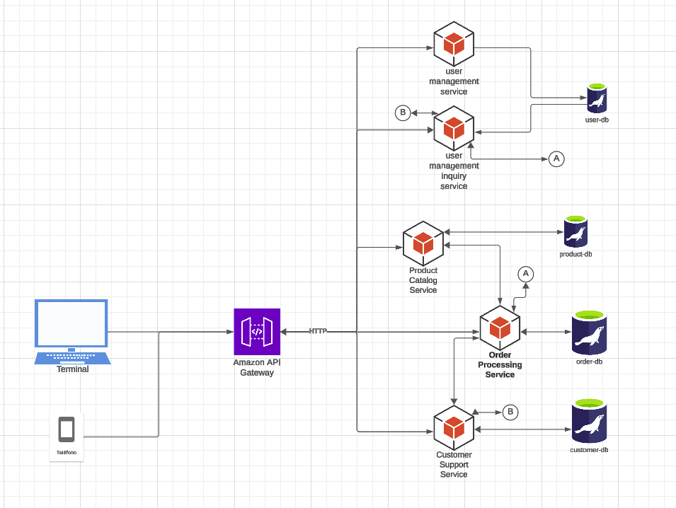

# Interacción de Servicios y Flujo de Comunicación
User Management Service: Proporciona autenticación, autorización y control de perfiles de usuario. Este servicio puede interactuar con el API Gateway para manejar sesiones y tokens de autenticación.

* **Product Catalog Service:** Es responsable de proporcionar detalles de productos a otras aplicaciones y al frontend, gestionando precios e inventario. Se comunica con el Order Processing Service cuando se necesitan actualizaciones de inventario durante el proceso de compra.

* **Order Processing Service:** Realiza el seguimiento del carrito de compras y administra todo el proceso de pedidos. Interactúa con el User Management Service para verificar las preferencias de los usuarios y el Product Catalog Service para obtener detalles de productos e inventario. Además, se comunica con el Customer Support Service cuando se requiere información del cliente en caso de devoluciones.

* **Customer Support Service:** Administra las solicitudes de ayuda o devoluciones de los usuarios. Puede acceder al historial de órdenes del Order Processing Service y a la información de usuario del User Management Service para resolver consultas.

* **API Gateway:** Controla todas las solicitudes externas y las dirige al servicio adecuado. Ofrece autenticación, autorización y balanceo de carga.

# Estrategia para Manejar Dependencias de Datos

Como prioridad Cada microservicio deberá tener su propia base de datos :

* **Dividir el esquema monolítico:** Extraer tablas y datos relacionados con cada servicio en bases de datos independientes. Por ejemplo, usuarios y preferencias se moverán al User Management Service, mientras que productos e inventario irán al Product Catalog Service.
* **Sincronización de datos temporal:** Para la transición, utiliza bases de datos compartidas temporalmente o servicios de mensajería que permitan actualizar datos en tiempo real entre servicios mientras la migración se completa.

después de la migración, seria dividir el monolito por funcionalidad.
Empezar por la funcionalidad que tenga menos dependencias con otros, en éste caso seria el servicio **product catalog service**.

## Proceso de Migración de la Base de Datos Monolítica
* **Definir Esquemas de Base de Datos por Servicio:** Crear bases de datos independientes para cada microservicio según sus necesidades.
* **Migración de Datos:** Realizar migraciones de datos con scripts ETL para transferir datos del esquema monolítico a las bases de datos distribuidas.
* **Pruebas de Integración y Validación:** Validar que cada servicio puede acceder a su base de datos y comunicarse con otros servicios correctamente.

# Informe de Reflexión
* **Fragmentación de Datos:** Al dividir la base de datos, es difícil mantener la consistencia de datos en tiempo real, especialmente en entidades compartidas (como usuario u órdenes).
* **Comunicación entre Servicios:** La interacción de microservicios requiere que cada servicio maneje bien los tiempos de respuesta. La mensajería asíncrona es fundamental, pero complica el monitoreo y manejo de fallos.
* **Pruebas y Validación:** Con servicios independientes, probar toda la funcionalidad en conjunto puede ser complejo. Necesitamos pruebas de integración rigurosas y herramientas de monitoreo para evitar errores.

